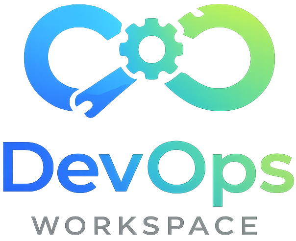

    

---

## 🧭 Guia de Navegação (Índice)

- **[📖 Descrição](#descricao)**
- **[🐧 Cheatsheet de Comandos Linux (CLI)](#linux-cli-cheatsheet)**
- **[👤 Sobre o Desenvolvedor](#sobre-o-desenvolvedor)**
- **[📜 Licença](#licenca)**

---

## 📖 Descrição 

Este repositório é um workspace de aprendizado DevOps, focado em automação de tarefas administrativas e práticas essenciais de infraestrutura. Aqui você encontra exemplos de scripts Bash para backup, monitoramento, gerenciamento de usuários, análise de logs, agendamento com cron e outras rotinas comuns no dia a dia de DevOps e administração de sistemas Linux. O objetivo é servir como base prática para estudos, desafios e desenvolvimento de habilidades em automação e operações.

---

## 🐧 Cheatsheet de Comandos Linux (CLI) 

| Pacote / Serviço | O que você aprende              | Exemplo de uso             |
| ---------------- | ------------------------------- | -------------------------- |
| **openssh**      | Acesso remoto seguro via SSH    | `ssh user@ip_da_maquina`   |
| **tree**         | Visualizar diretórios em árvore | `tree -I "node_modules"`   |
| **curl**         | Baixar e enviar dados pela web  | `curl https://example.com` |

Veja mais exemplos e dicas práticas no cheatsheet completo!

> 💡 **Acesse a [Linux CLI Cheatsheet](./docs/guides/linux-cli-cheatsheet.md) para conferir todos os comandos, dicas e exemplos!**

---

## 👤 Sobre o Desenvolvedor 

<table align="center">
  <tr>
    <td align="center">
         
        
        

        <a href="https://github.com/0nF1REy" target="_blank">
          <strong>Alan Ryan</strong>
        </a>
        

        ☕ Peopleware | Tech Enthusiast | Code Slinger ☕
         
        Apaixonado por código limpo, arquitetura escalável e experiências digitais envolventes
        

          Conecte-se comigo:
        

        
        
        
        

    </td>
  </tr>
</table>

---

## 📜 Licença 

Este projeto está sob a **licença MIT**. Consulte o arquivo **[LICENSE](LICENSE)** para obter mais detalhes.

> ℹ️ **Aviso de Licença:** &copy; 2026 Alan Ryan da Silva Domingues. Este projeto está licenciado sob os termos da licença MIT. Isso significa que você pode usá-lo, copiá-lo, modificá-lo e distribuí-lo com liberdade, desde que mantenha os avisos de copyright.

⭐ Se este repositório foi útil para você, considere dar uma estrela!
